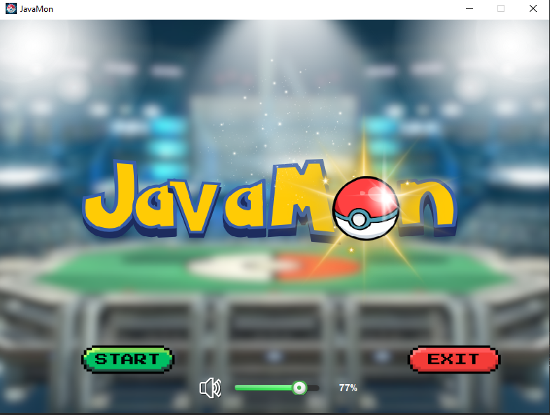
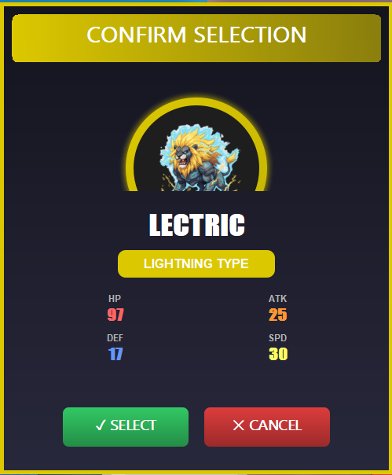
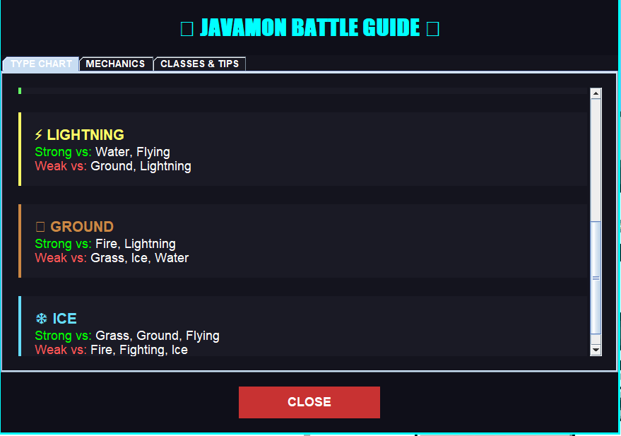
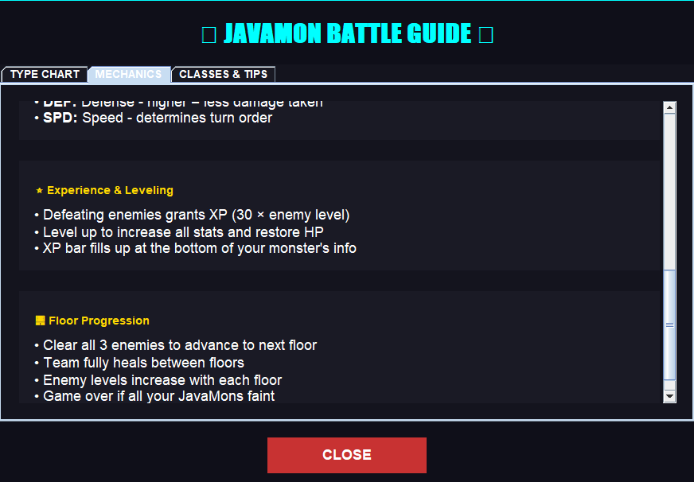
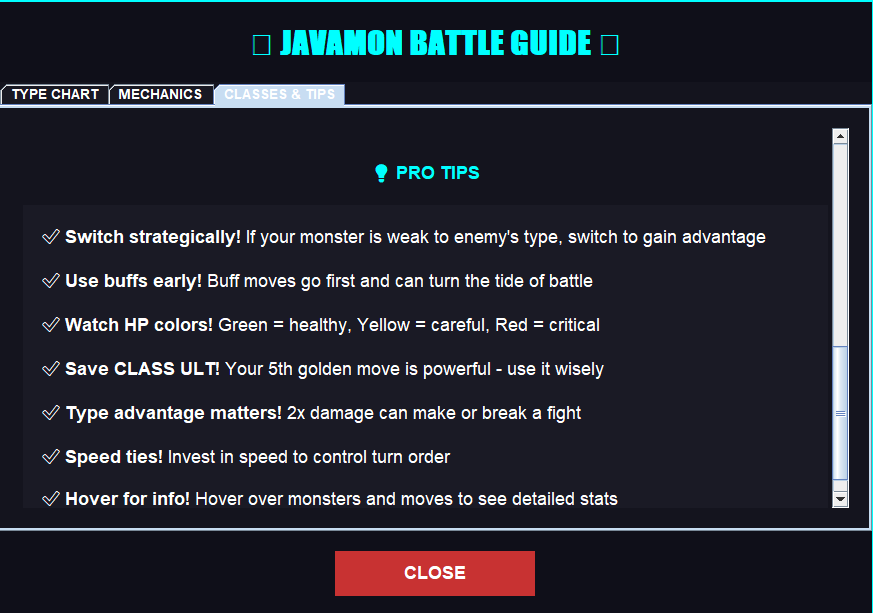
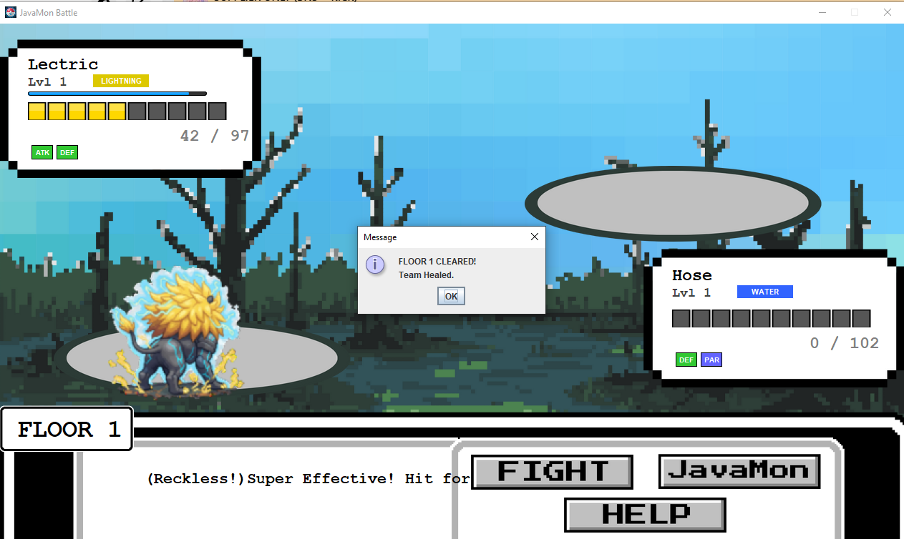

# JavaMon


## Project Overview

JavaMon is a Pokémon-inspired game developed using Java with a graphical user interface (GUI). The main purpose of the project is to provide an interactive turn-based battle system where players act as trainers and control monsters with unique abilities and stats. The game allows users to select trainers, choose monsters, engage in battles, and view outcomes such as win or game-over screens.

JavaMon solves the problem of demonstrating Object-Oriented Programming (OOP) concepts in a fun and practical way by simulating real-world relationships between trainers, monsters, abilities, and game mechanics. This project is intended for students and users who want to experience a simple RPG-style game while showcasing OOP principles in Java.

---

## OOP Concepts Applied

### Encapsulation
Encapsulation is applied by grouping data and behavior into classes such as Trainer, Monster, Ability, and DatabaseManager. Each class manages its own attributes (e.g., health, abilities, trainer name) and provides controlled access through methods, ensuring data integrity.

### Abstraction
Abstraction is used to hide complex game logic from the user. For example, battle calculations, ability effects, and status effects are handled internally by classes like BattleMechanics, AbilityLogic, and StatusEffect, while the GUI only interacts with high-level methods.

### Inheritance
Inheritance is implemented where shared behaviors and properties are reused. Monsters and abilities can inherit common attributes, allowing specialized behavior without duplicating code.

### Polymorphism
Polymorphism is applied through abilities and effects where different abilities can execute different logic while using the same method structure. This allows flexible expansion of abilities without changing existing code.

---

## Program Structure

### Main Classes and Their Roles

- **MainMenu** – Entry point of the program; displays the main menu GUI  
- **TrainerSelection** – Allows the user to select a trainer  
- **Monster** – Represents monsters with stats such as health and abilities  
- **Ability / AbilityLogic** – Defines and executes monster abilities  
- **BattleMechanics** – Controls turn-based combat logic  
- **GameWindow** – Main gameplay interface  
- **GameOver** – Displays the game over screen  
- **DatabaseManager** – Handles database operations using `javmon.db`  
- **StatusEffect** – Manages effects such as buffs or debuffs  

---

## How to Run the Program

1. Make sure **Java JDK 21** is installed on your computer  
2. Install **Git** and an IDE such as **Eclipse** or **VS Code**  
3. Open a terminal or command prompt  
4. Clone the project repository:
   ```bash
   git clone https://github.com/bitancutiepie/JavaMon.git
   ```
5. Open the cloned JavaMon folder in your IDE  
6. Select the JavaMon project and go to **Properties**  
7. Go to **Libraries**, select **Add External JARs**, then navigate to:  
   `JavaMon/Javamon/lib/`  
   and add `sqlite-jdbc-3.51.0.0.jar`  
8. Locate the `MainMenu.java` file inside the `src/javmon` package  
9. Run the file as a **Java Application**  
10. The JavaMon game window will launch and you can start playing  

---

## Sample Output / Gameplay Flow

- The game starts on the **Main Menu**, where the user can adjust the volume settings and click **Start**.
    
- The **Trainer Selection** screen allows the user to choose from five unique trainers, each with distinct abilities and perks.
  
   
- The user proceeds to the **Draft Selection**, where JavaMons with unique abilities, classes, and special skills are presented.
  
  
- The user selects **three JavaMons**, with confirmation prompts displaying each JavaMon’s vital statistics.
  
  
- The game then proceeds to the **Game Window**, where each JavaMon has four abilities and one Ultimate Ability depending on its class.
  
  
- The user can hover over Ally and Enemy JavaMons to view their stats.
  
  
- JavaMons can be swapped using the **JAVAMON** button.
  
  
- The **HELP** button displays the Type Chart, Game Mechanics, and Classes & Tips.
    
  
- Each defeated enemy grants **XP** to the JavaMon that delivers the finishing blow.
  
- JavaMons level up and become stronger for later rounds.
  
  
- If the player fails to defeat the opposing team, a **Game Over** screen appears with options to return to the Main Menu or exit.
  

---

## Authors

- **Balbuena, Adrian G.** – Lead Creative Designer for the overall GUI and elements  
- **Bitancor, Joshua Vincent (Group Leader)** – Lead Programmer for game design and logic, System Analyst, debugging, game balancing, and project management  
- **Catapang, Leann Kirsten T.** – GUI Design and Game Logic Programmer  
- **Plata, Cris Ed John P.** – Lead Developer for system architecture and GUI design  

---

## Acknowledgement

We would like to thank our instructor for guidance throughout the development of this project and for managing multiple academic timelines alongside the workload of this project.

We also acknowledge the Java documentation and open-source resources that helped in completing this project.

---

## References

- Pokémon  
- PokéRogue  
- Roguelike games  
- Roguelike floor-based games  

---

## Future Enhancements

### JavaMon Balancing
JavaMon abilities and statistics should be properly balanced to ensure fair and competitive gameplay and prevent overpowered strategies.

### Reward System per Floor
Implementing a reward system after each completed floor would improve player progression and engagement.

### Move Set Limit
Introducing a move set limit would promote strategic decision-making when selecting abilities.

### Expanded JavaMon Selection
Adding more JavaMons would increase variety, replayability, and strategic depth.

### Move Set Learning Through Leveling
Allowing JavaMons to learn new abilities as they level up would enhance progression and immersion.
